# 🏗️ BlockMed Architecture Documentation

For a **full explanation of how blockchain works** in this project (contract, connection layer, Dev Mode vs Wallet, indexer, diagrams), see **[docs/BLOCKCHAIN_HOW_IT_WORKS.md](./docs/BLOCKCHAIN_HOW_IT_WORKS.md)**.

---

## System Architecture Overview

```mermaid
graph TB
    User[👨‍⚕️ Doctor / Pharmacist] --> Browser[Web Browser]
    Browser --> DevMode[🔧 Dev Mode]
    Browser --> MetaMask[🦊 MetaMask Wallet]
    Browser --> Frontend[⚛️ React Frontend]
    
    Frontend --> Router[React Router]
    Router --> Login[LoginPage]
    Router --> Dashboard[Dashboard Page]
    Router --> Prescription[CreatePrescription Page]
    Router --> Pharmacy[PharmacyVerification Page]
    
    Prescription --> QR[QR Code Generator]
    
    DevMode --> contractHelper[contractHelper.js]
    MetaMask --> contractHelper
    contractHelper --> Contract[📄 BlockMedV2 Contract]
    
    Contract --> Blockchain[(🔗 Blockchain)]
    
    Prescription --> IPFS[IPFS / JSON payload]
    
    style User fill:#667eea,color:#fff
    style MetaMask fill:#f6851b,color:#fff
    style Frontend fill:#61dafb,color:#000
    style Contract fill:#627eea,color:#fff
    style Blockchain fill:#764ba2,color:#fff
```

## Component Flow

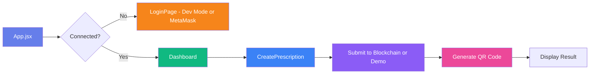

## Data Flow

```mermaid
sequenceDiagram
    participant Doctor
    participant UI
    participant MetaMask
    participant Contract
    participant Blockchain
    
    Doctor->>UI: Open App
    UI->>MetaMask: Request Connection
    MetaMask->>Doctor: Approve?
    Doctor->>MetaMask: Approve
    MetaMask->>UI: Connected ✅
    
    Doctor->>UI: Fill Prescription Form
    Doctor->>UI: Click Submit
    UI->>MetaMask: Request Transaction
    MetaMask->>Doctor: Confirm Transaction?
    Doctor->>MetaMask: Confirm
    MetaMask->>Contract: Send Transaction
    Contract->>Blockchain: Store Data
    Blockchain->>Contract: Transaction Hash
    Contract->>UI: Success + Hash
    UI->>UI: Generate QR Code
    UI->>Doctor: Show QR + Hash
```

## Smart Contract Structure (BlockMedV2)

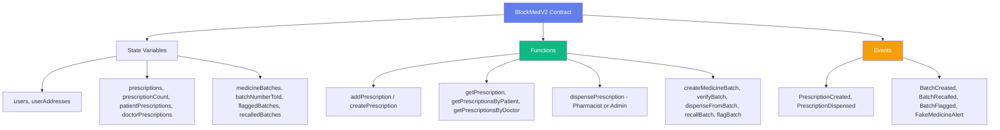

## Frontend Component Hierarchy

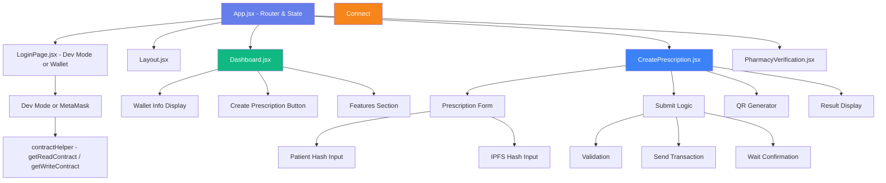

## Technology Stack Layers

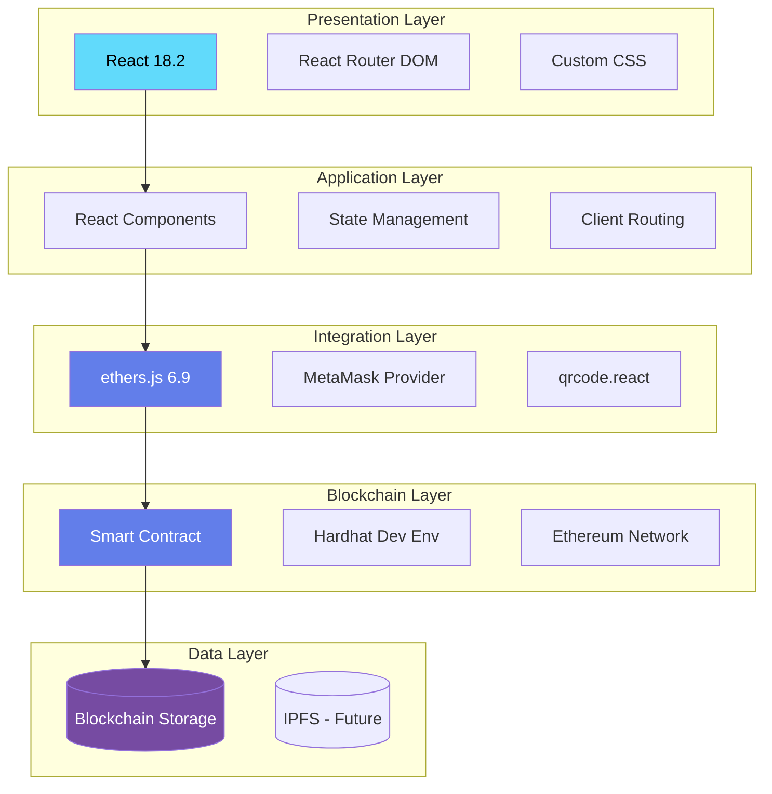

## Network Architecture

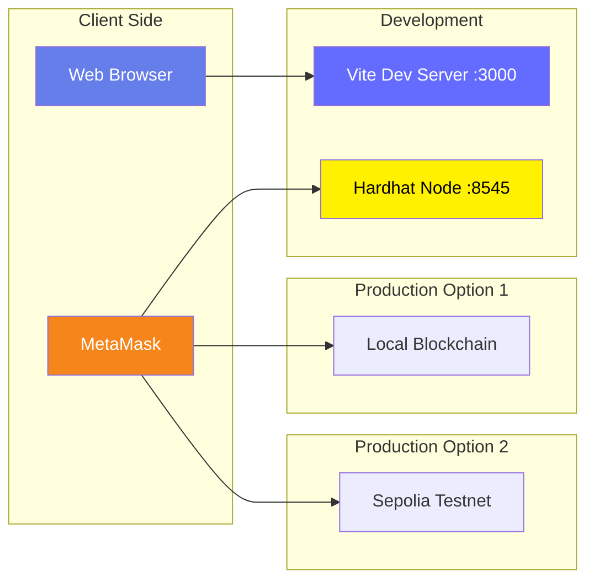

## File Organization

```
BlockMed V1.2/
│
├── 📁 contracts/                  # Blockchain Layer
│   └── BlockMedV2.sol            # Smart Contract (RBAC, prescriptions, batches)
│
├── 📁 scripts/                    # Deployment & Utilities
│   ├── check-and-deploy.cjs     # Deploy + update config + .env.local
│   ├── indexer/index.js          # Event indexer (port 3002)
│   ├── verify-user.cjs          # CLI: verify user
│   └── test-*.mjs, test-local.cjs
│
├── 📁 src/                        # Frontend Application
│   │
│   ├── 📁 components/            # Reusable Components
│   │   ├── Layout.jsx           # Main layout with sidebar
│   │   ├── BlockchainInfo.jsx   # Blockchain status
│   │   └── ErrorBoundary.jsx    # Error boundary
│   │
│   ├── 📁 pages/                 # Route Pages
│   │   ├── LoginPage.jsx        # Login (Dev Mode or Wallet)
│   │   ├── Dashboard.jsx         # Dashboard
│   │   ├── CreatePrescription.jsx # Prescription creation
│   │   ├── PharmacyVerification.jsx # Verify & dispense
│   │   ├── PrescriptionTemplates.jsx # Templates
│   │   ├── PatientPortal.jsx, PatientHistory.jsx
│   │   ├── MedicineManagement.jsx, BatchManagement.jsx
│   │   ├── UserManagement.jsx, Analytics.jsx, Settings.jsx
│   │   └── ActivityLog.jsx
│   │
│   ├── 📁 store/                 # State Management
│   │   └── useStore.js          # Zustand (user, demo data)
│   │
│   ├── 📁 hooks/                 # React Hooks
│   │   └── useBlockchain.js     # Blockchain connection
│   │
│   ├── 📁 utils/                 # Utilities & Config
│   │   ├── config.js            # Contract address & networks
│   │   ├── contractHelper.js    # Contract read/write
│   │   ├── devMode.js           # Dev Mode accounts
│   │   ├── blockchainData.js    # Fetch data helpers
│   │   ├── helpers.js            # Utilities
│   │   ├── provider.js, walletFund.js
│   │   └── contractABI.json     # Contract Interface
│   │
│   ├── 📁 i18n/                  # Translations (English & Bangla)
│   ├── 📁 data/                  # medicines.json, demoBatches.js
│   ├── App.jsx                   # Main App Component (Router)
│   ├── main.jsx                  # React Entry
│   └── index.css                 # TailwindCSS Styles
│
├── 📁 docs/                      # Documentation
│   ├── BLOCKCHAIN_HOW_IT_WORKS.md
│   ├── PRIVACY_ONCHAIN.md
│   └── METAMASK_LOCALHOST_FIX.md
│
├── 📁 test/                      # Tests
│   └── BlockMedV2.test.cjs
│
├── 📄 index.html                 # HTML Template
├── 📄 package.json               # Dependencies
├── 📄 vite.config.js             # Vite Config
├── 📄 hardhat.config.cjs         # Hardhat Config
├── 📄 tailwind.config.js         # Tailwind Config
│
└── 📚 Documentation/
    ├── README.md, START_HERE.md, QUICK_START.md
    ├── DEPLOYMENT_GUIDE.md, BLOCKMED_V2_GUIDE.md
    ├── BLOCKCHAIN_DATA_PERSISTENCE.md, ARCHITECTURE.md
    ├── PROJECT_SUMMARY.md, TESTING_CHECKLIST.md
    ├── TROUBLESHOOTING.md, WALLET_SETUP.md
    └── SUPER_ADMIN_PORTAL.md
```

## State Management Flow

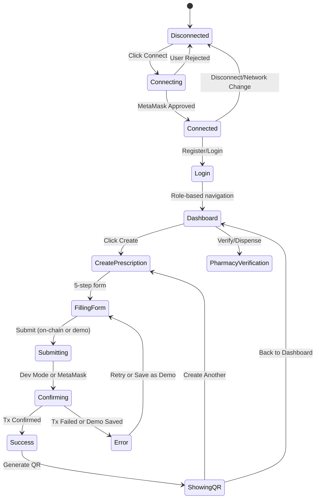

## Security Architecture

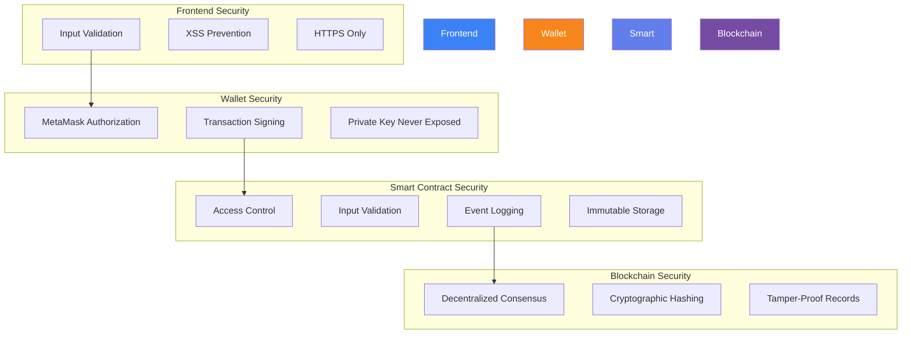

## Deployment Pipeline

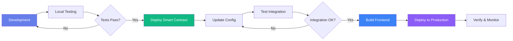

## Key Design Decisions

### 1. Why React?
- Component-based architecture
- Easy state management
- Large ecosystem
- Fast with Vite

### 2. Why ethers.js v6?
- Modern API
- Better TypeScript support
- Smaller bundle size
- Active development

### 3. Why Hardhat?
- Fast local blockchain
- Built-in testing
- Easy debugging
- Plugin ecosystem

### 4. Why MetaMask?
- Most popular Web3 wallet
- Easy integration
- Widely trusted
- Cross-browser support

### 5. Why QR Codes?
- Universal compatibility
- Easy scanning
- No app required
- Future blockchain linking

## Scalability Considerations

### Current Design
- Single doctor per transaction
- Sequential prescription creation
- On-chain storage only
- Simple validation

### Future Enhancements
- Multi-doctor collaboration
- Batch prescription creation
- Off-chain indexing (The Graph)
- Advanced role-based access
- Layer 2 scaling solutions
- IPFS for document storage

## Performance Metrics

### Local Development
- Page Load: < 1 second
- MetaMask Connect: < 2 seconds
- Transaction Submit: < 5 seconds
- QR Generation: Instant

### Testnet (Sepolia)
- Transaction Confirm: 15-30 seconds
- Block Time: ~12 seconds
- Gas Costs: Minimal (testnet)

## Monitoring & Logging

### Frontend Logs
- Component lifecycle events
- State changes
- Error messages
- User actions

### Blockchain Events
- PrescriptionAdded
- PrescriptionVerified
- Transaction hashes
- Block numbers

### MetaMask Events
- Account changes
- Network switches
- Connection status
- Transaction status

## Error Handling Strategy

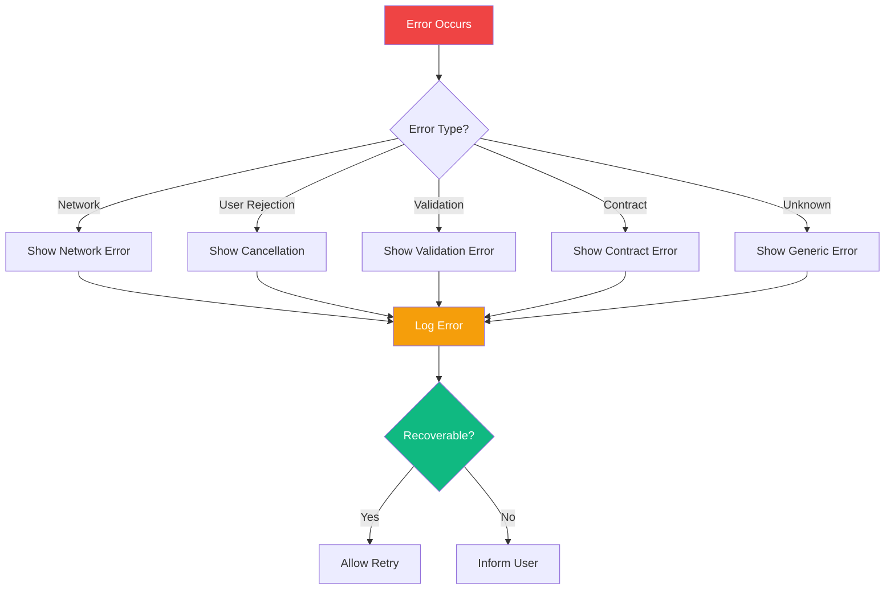

## Future Architecture (Phase 3)

```mermaid
graph TB
    subgraph Users
        Doctor[👨‍⚕️ Doctor]
        Patient[👤 Patient]
        Pharmacy[💊 Pharmacy]
    end
    
    subgraph Frontend
        DoctorUI[Doctor Dashboard]
        PatientUI[Patient Portal]
        PharmacyUI[Pharmacy Verification]
    end
    
    subgraph Backend Services
        Auth[Authentication Service]
        IPFS[IPFS Service]
        Indexer[Graph Indexer]
    end
    
    subgraph Blockchain
        Contract[Enhanced Smart Contract]
        Events[Event System]
    end
    
    Doctor --> DoctorUI
    Patient --> PatientUI
    Pharmacy --> PharmacyUI
    
    DoctorUI --> Auth
    PatientUI --> Auth
    PharmacyUI --> Auth
    
    DoctorUI --> IPFS
    
    Auth --> Contract
    IPFS --> Contract
    Indexer --> Events
    
    style Doctor fill:#667eea,color:#fff
    style Patient fill:#10b981,color:#fff
    style Pharmacy fill:#f59e0b,color:#fff
```

---

## Summary

**BlockMed V1.2 / V2** follows a clean, layered architecture:

1. **Presentation Layer** - React UI components (pages, Layout, BlockchainInfo)
2. **Integration Layer** - ethers.js + MetaMask
3. **Smart Contract Layer** - Solidity blockchain logic
4. **Storage Layer** - Ethereum blockchain

This architecture ensures:
- ✅ Separation of concerns
- ✅ Easy testing
- ✅ Scalability
- ✅ Security
- ✅ Maintainability

**Ready for supervisor demo and future enhancements! 🚀**
