# 🏗️ BlockMed Architecture Documentation

## System Architecture Overview

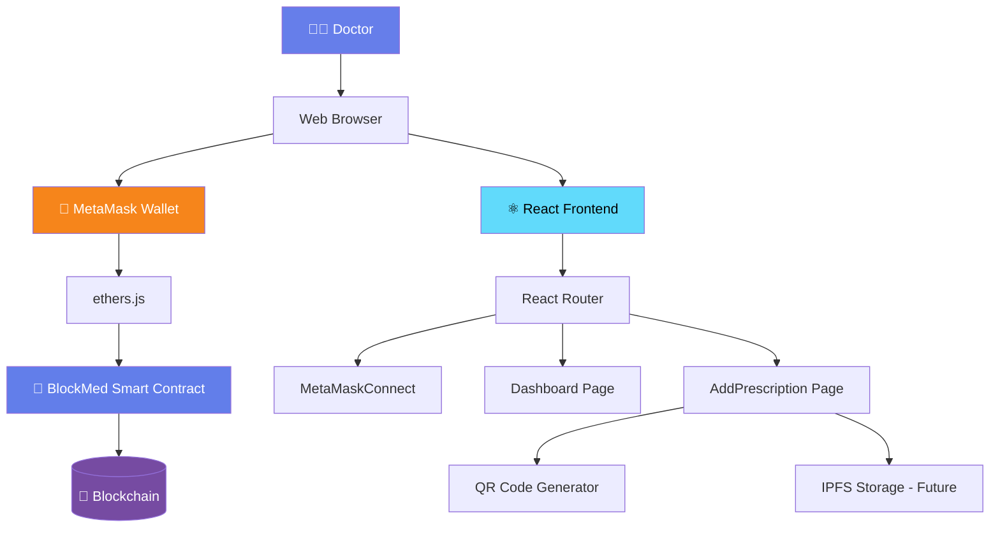

## Component Flow

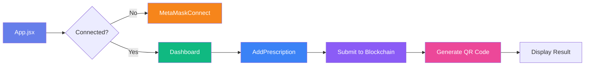

## Data Flow

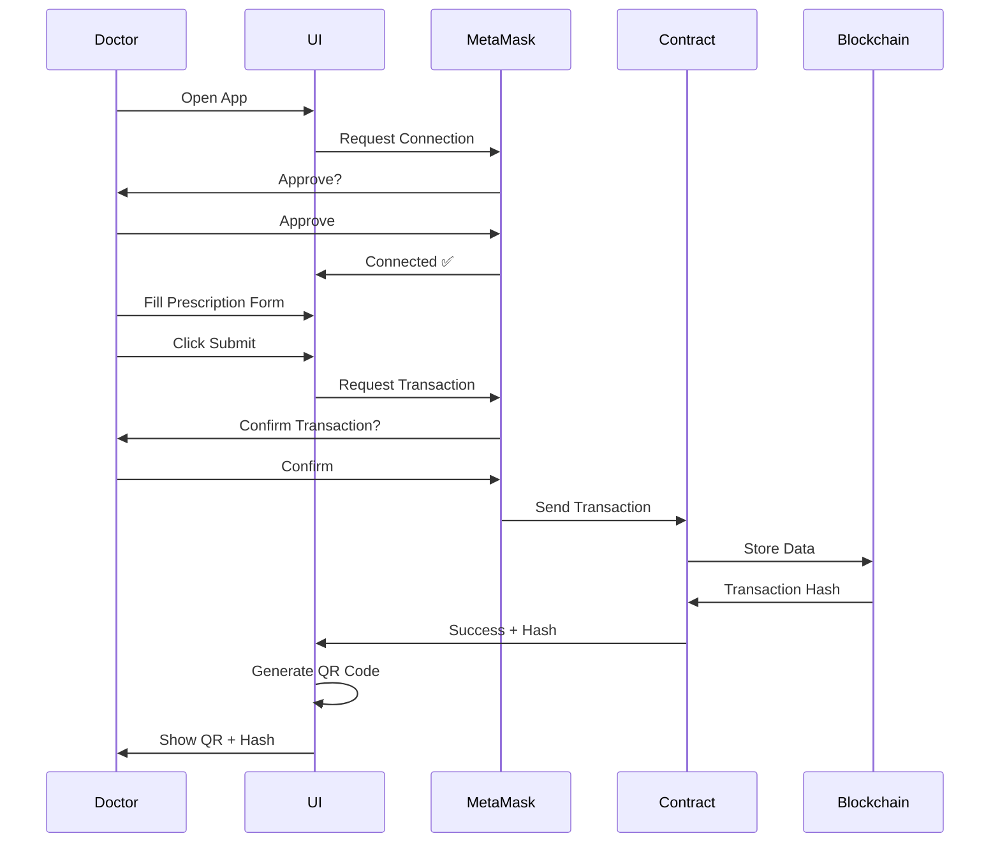

## Smart Contract Structure

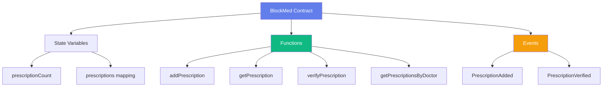

## Frontend Component Hierarchy

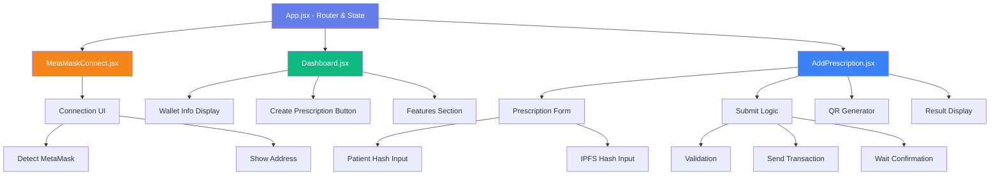

## Technology Stack Layers

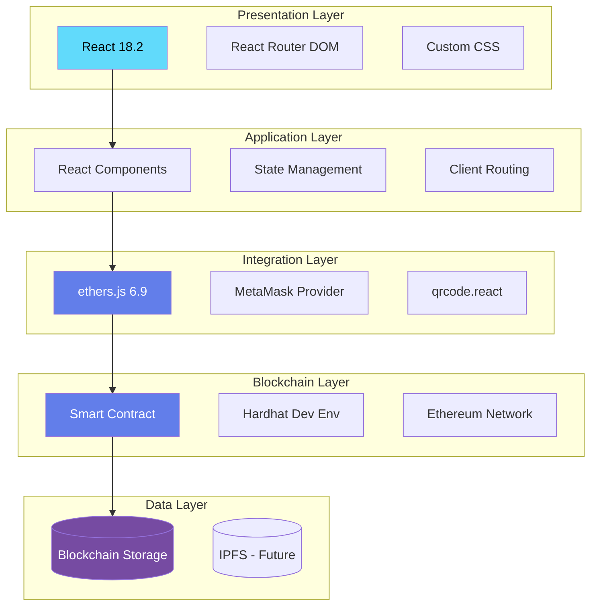

## Network Architecture

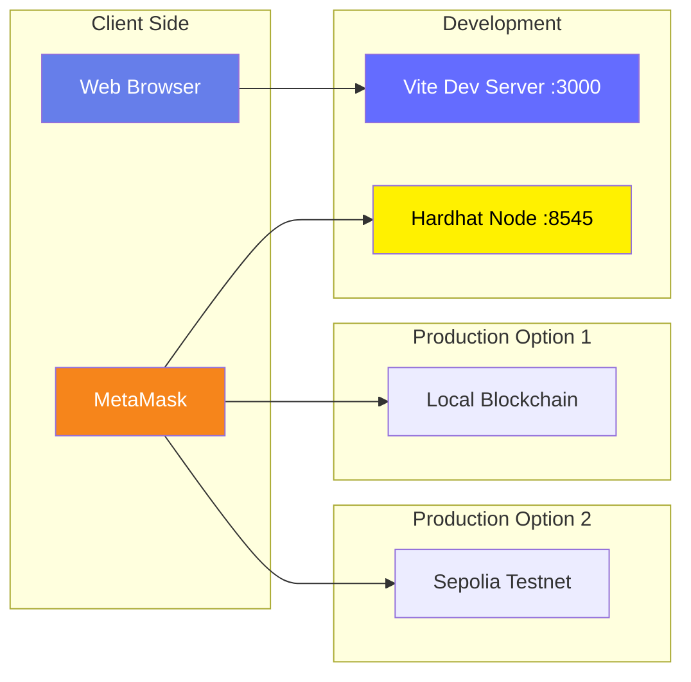

## File Organization

```
BlockMed V1.1/
│
├── 📁 contracts/                  # Blockchain Layer
│   └── BlockMed.sol              # Smart Contract
│
├── 📁 scripts/                    # Deployment
│   └── deploy.js                 # Deploy Script
│
├── 📁 src/                        # Frontend Application
│   │
│   ├── 📁 components/            # Reusable Components
│   │   └── MetaMaskConnect.jsx   # Wallet Connection
│   │
│   ├── 📁 pages/                 # Route Pages
│   │   ├── Dashboard.jsx         # Home Page
│   │   └── AddPrescription.jsx   # Prescription Page
│   │
│   ├── 📁 utils/                 # Utilities & Config
│   │   ├── contractABI.json      # Contract Interface
│   │   └── config.js             # Configuration
│   │
│   ├── App.jsx                   # Main App Component
│   ├── main.jsx                  # React Entry
│   └── index.css                 # Global Styles
│
├── 📄 index.html                  # HTML Template
├── 📄 package.json                # Dependencies
├── 📄 vite.config.js              # Vite Config
├── 📄 hardhat.config.js           # Hardhat Config
│
└── 📚 Documentation/
    ├── README.md
    ├── QUICK_START.md
    ├── DEPLOYMENT_GUIDE.md
    ├── TESTING_CHECKLIST.md
    ├── PROJECT_SUMMARY.md
    └── ARCHITECTURE.md
```

## State Management Flow

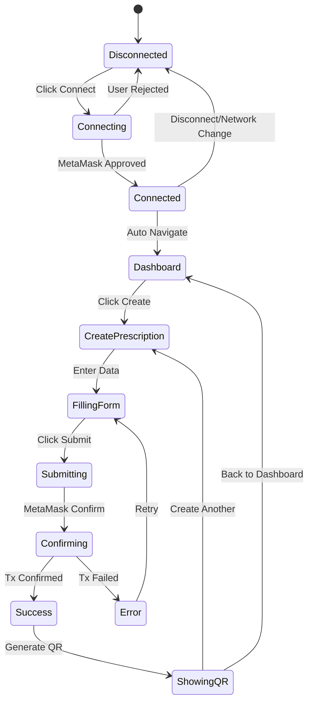

## Security Architecture

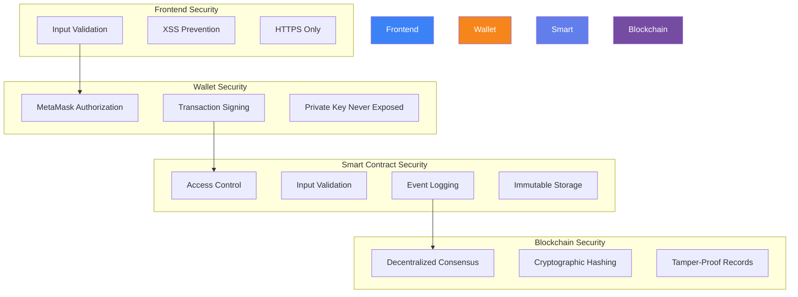

## Deployment Pipeline

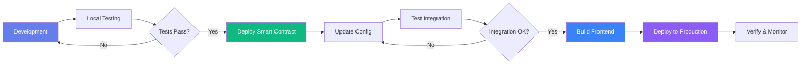

## Key Design Decisions

### 1. Why React?
- Component-based architecture
- Easy state management
- Large ecosystem
- Fast with Vite

### 2. Why ethers.js v6?
- Modern API
- Better TypeScript support
- Smaller bundle size
- Active development

### 3. Why Hardhat?
- Fast local blockchain
- Built-in testing
- Easy debugging
- Plugin ecosystem

### 4. Why MetaMask?
- Most popular Web3 wallet
- Easy integration
- Widely trusted
- Cross-browser support

### 5. Why QR Codes?
- Universal compatibility
- Easy scanning
- No app required
- Future blockchain linking

## Scalability Considerations

### Current Design
- Single doctor per transaction
- Sequential prescription creation
- On-chain storage only
- Simple validation

### Future Enhancements
- Multi-doctor collaboration
- Batch prescription creation
- Off-chain indexing (The Graph)
- Advanced role-based access
- Layer 2 scaling solutions
- IPFS for document storage

## Performance Metrics

### Local Development
- Page Load: < 1 second
- MetaMask Connect: < 2 seconds
- Transaction Submit: < 5 seconds
- QR Generation: Instant

### Testnet (Sepolia)
- Transaction Confirm: 15-30 seconds
- Block Time: ~12 seconds
- Gas Costs: Minimal (testnet)

## Monitoring & Logging

### Frontend Logs
- Component lifecycle events
- State changes
- Error messages
- User actions

### Blockchain Events
- PrescriptionAdded
- PrescriptionVerified
- Transaction hashes
- Block numbers

### MetaMask Events
- Account changes
- Network switches
- Connection status
- Transaction status

## Error Handling Strategy

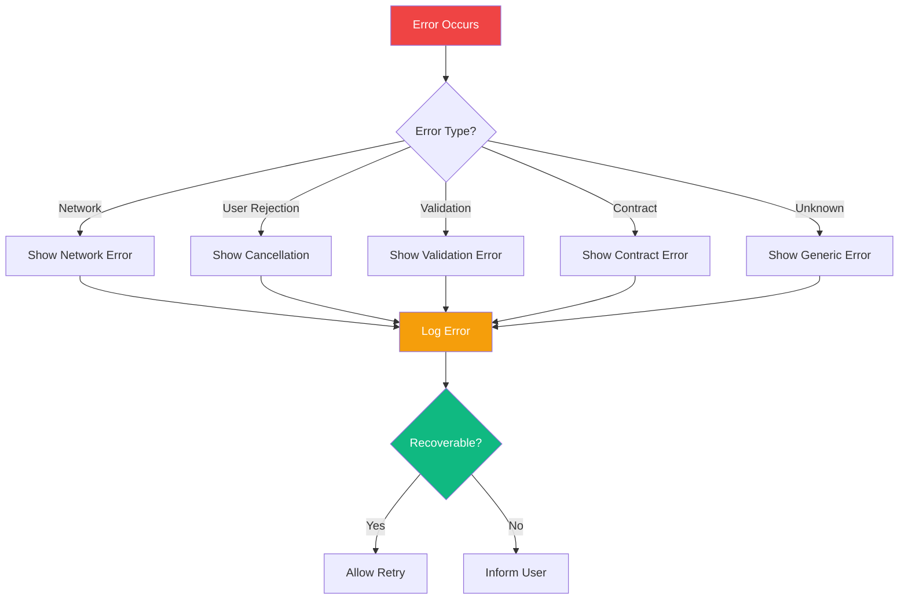

## Future Architecture (Phase 3)

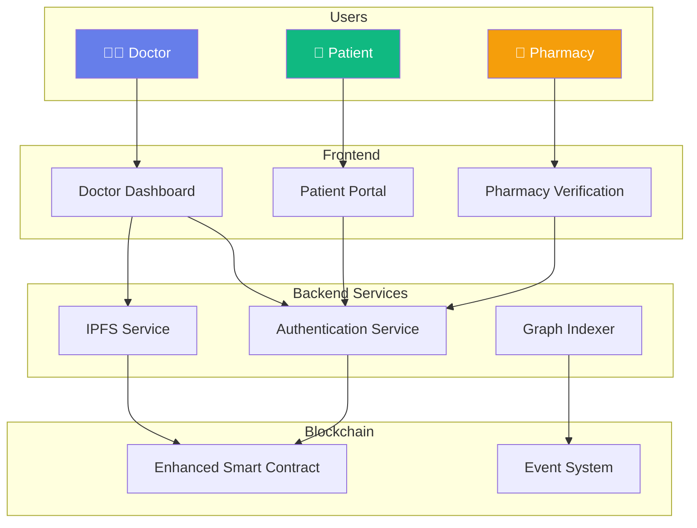

---

## Summary

**BlockMed V1.1** follows a clean, layered architecture:

1. **Presentation Layer** - React UI components
2. **Integration Layer** - ethers.js + MetaMask
3. **Smart Contract Layer** - Solidity blockchain logic
4. **Storage Layer** - Ethereum blockchain

This architecture ensures:
- ✅ Separation of concerns
- ✅ Easy testing
- ✅ Scalability
- ✅ Security
- ✅ Maintainability

**Ready for supervisor demo and future enhancements! 🚀**
