# Blockchain → BlockMed  
## Super Basic Explanation (University Level)

**Target:** University students | **Assumption:** Zero (একদম নতুন ধরেই)  
**Language:** Bangla + English mixed | **Style:** Part-by-part, task-by-task

এই ডক পড়লে কেউ **blockchain শোনেনি হলেও বুঝবে**।

---

## Part 1: What is Blockchain? (Zero Level)

### Blockchain মানে কী?

**Blockchain** হলো:

- একটা **computer system**
- যেটা **data রাখে**
- data রাখা হয় **record আকারে**
- এবং এই record **change করা যায় না**

সহজ ভাষায়:

> **Blockchain = Digital Khata (খাতা)**

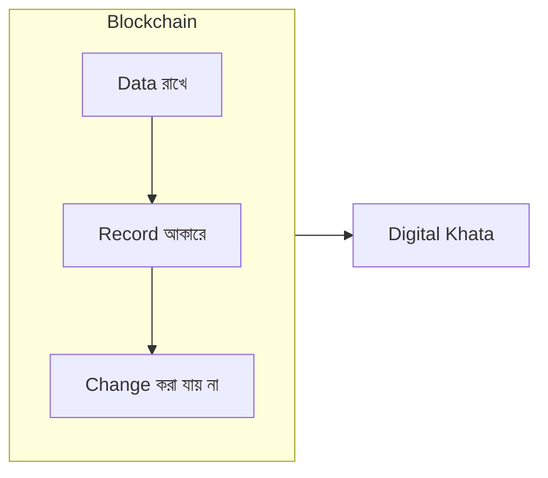

---

## Part 2: Why Blockchain Was Needed

আগে কী সমস্যা ছিল?

### Traditional System এ সমস্যা:

- Data এক জায়গায় থাকে
- এক জন বা এক প্রতিষ্ঠান control করে
- চাইলে data edit বা delete করতে পারে

### Blockchain কী করলো?

- Data অনেক জায়গায় copy করে রাখলো
- সবাই একই data দেখে
- কেউ একা বসে change করতে পারে না

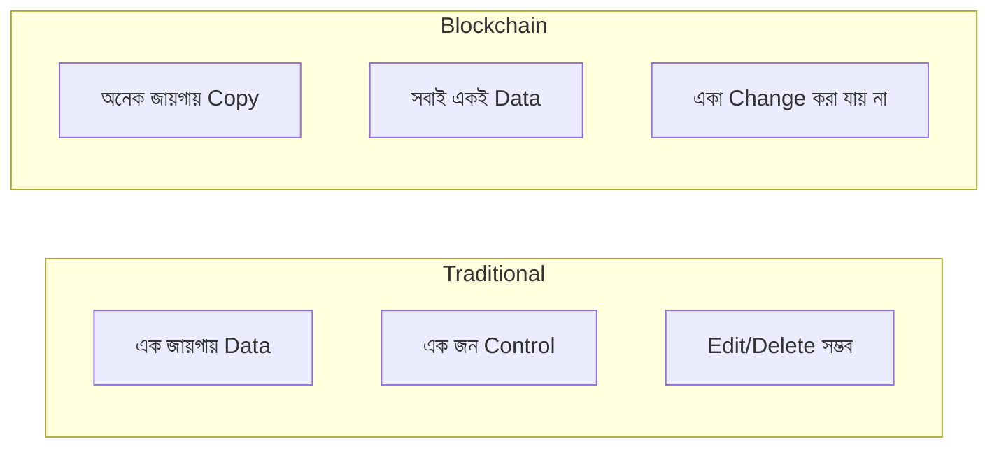

---

## Part 3: Important Words (Very Easy Meaning)

### Ledger

**Ledger** মানে:

- Record book
- Database
- Khata

👉 যেখানে সব তথ্য লেখা থাকে

---

### Transaction

**Transaction** মানে:

- Ledger এ **একটা নতুন entry**
- নতুন তথ্য যোগ করা

**Example:**  
“Prescription create করা” = 1 transaction

---

### Block

**Block** মানে:

- অনেকগুলো transaction একসাথে রাখা
- Ledger এর এক পৃষ্ঠা

👉 **1 block = many transactions**

---

### Blockchain

**Blockchain** মানে:

- অনেকগুলো block
- একটার সাথে আরেকটা যুক্ত
- sequence অনুযায়ী

👉 **Block + Block + Block = Blockchain**

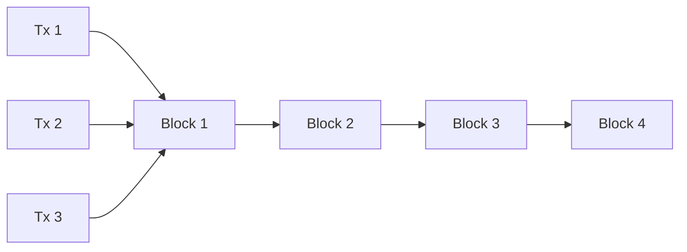

---

## Part 4: How Blockchain Works (Very Slowly)

Step by step:

1. কেউ একটি **transaction** তৈরি করে  
2. System transaction **check** করে  
3. Transaction **block** এ যায়  
4. Block **chain** এ যুক্ত হয়  
5. Data **permanent** হয়ে যায়  

👉 এরপর change করা যায় না

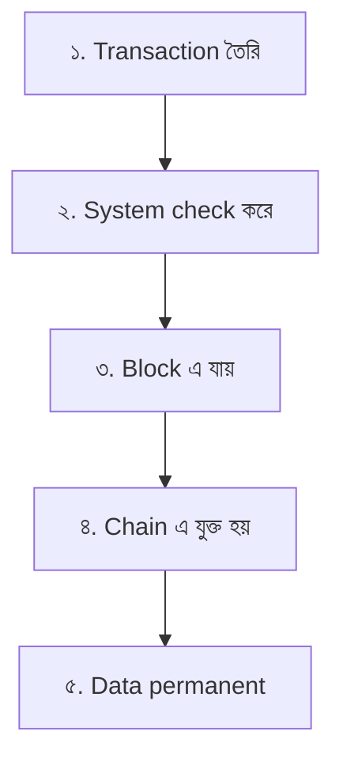

---

## Part 5: Why Blockchain Data Cannot Be Changed

কারণ:

- প্রত্যেক block **আগের block** এর সাথে যুক্ত
- পুরনো data change করলে **link ভেঙে** যায়
- System **ধরে ফেলে**

👉 তাই cheating **almost impossible**

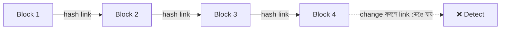

---

## Part 6: What is a Wallet? (Very Important)

### Wallet কী?

**Wallet** হলো:

- আপনার **digital identity**
- আপনার নামের মতো

Wallet এর মধ্যে থাকে:

- **Address** (public)
- **Private key** (secret)

---

### Address

**Address** মানে:

- Account number
- যেটা সবাই দেখতে পারে

**Example:**  
“এই prescription কে বানিয়েছে?”

---

### Private Key

**Private key** মানে:

- Password
- Secret key

⚠️ **কাউকে দেওয়া যাবে না**

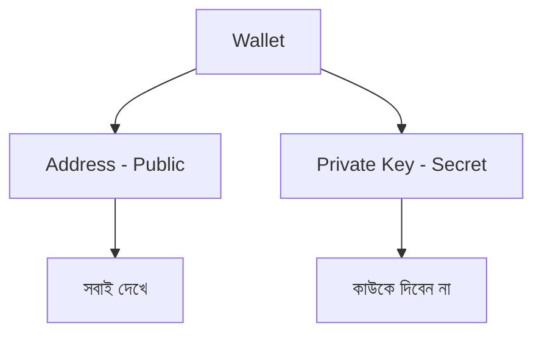

---

## Part 7: What is a Smart Contract?

**Smart Contract** হলো:

- Blockchain এর উপর চলা **program**
- **Automatic** rule follow করে

এটা:

- মানুষ না
- **Computer code**

---

### Example Rule:

```
If prescription is valid
  → approve
Else
  → reject
```

👉 No human decision  
👉 No cheating

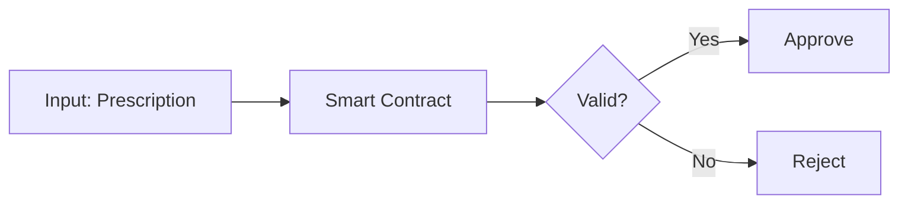

---

## Part 8: On-chain vs Off-chain (Easy)

### On-chain মানে:

- Data **blockchain** এ আছে
- **Public**
- **Permanent**

**Example:**

- Prescription ID
- Status (used / unused)

---

### Off-chain মানে:

- Data blockchain এ **নেই**
- **Database** এ আছে
- **Private**

**Example:**

- Patient name
- Medical details

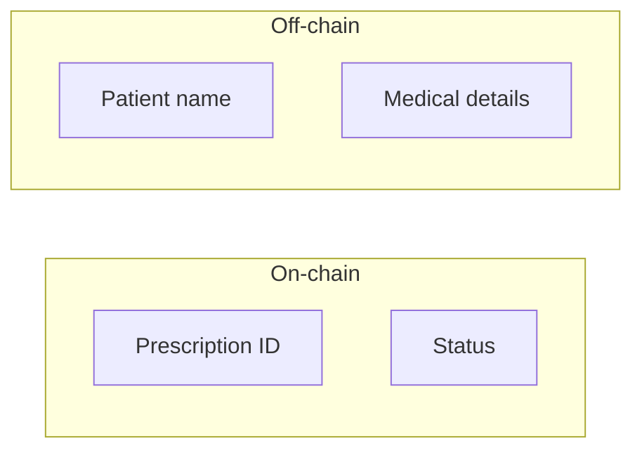

---

## Part 9: Now the Project — BlockMed

### BlockMed কী?

**BlockMed** হলো:

- **Healthcare blockchain** project
- Medicine + prescription নিয়ে কাজ করে

**Goal:**

- Fake prescription ধরা
- Medicine misuse বন্ধ করা

---

## Part 10: Why BlockMed is Needed

### Traditional prescription:

- Paper based
- Easy to copy
- Easy to reuse

### BlockMed prescription:

- **QR code** based
- **Blockchain** verified
- **One-time** usable

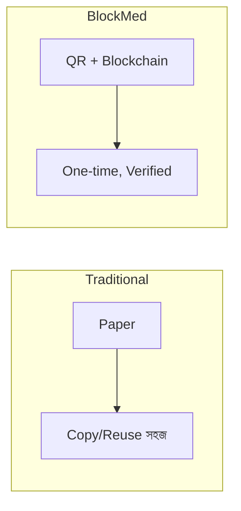

---

## Part 11: BlockMed Full Task Flow (Very Clear)

### Step 1: Doctor Task

- Doctor **prescription create** করে
- System **QR code** বানায়

---

### Step 2: Blockchain Task

- Prescription ID **blockchain** এ store হয়
- **Smart contract** rules apply করে

---

### Step 3: Pharmacy Task

- Pharmacy **QR scan** করে
- **Blockchain verify** করে

---

### Step 4: Result

- **Valid** → medicine give  
- **Invalid** → reject

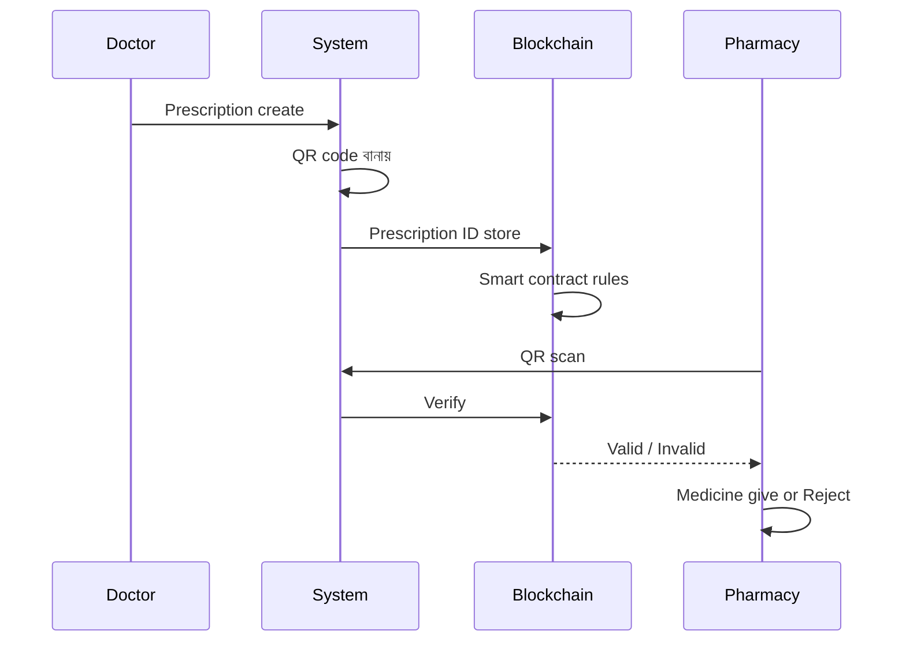

---

## Part 12: Where Each Technology Is Used

| Technology      | Use                          |
|-----------------|------------------------------|
| **Blockchain**  | Prescription proof, Status   |
| **Smart Contract** | Rules checking           |
| **UI (Website)**   | User interaction         |
| **Indexer**     | Blockchain data read করা    |
| **Database**    | Fast search & history       |

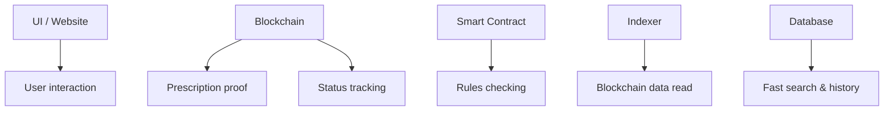

---

## Part 13: Student Task (Demo)

### What student does:

1. Project **run** করে:

   ```bash
   npm run start
   ```

2. **UI** open করে  
3. **Prescription create** করে  
4. **QR scan** করে  
5. **Result observe** করে  

---

## Part 14: What Students Are Actually Learning

Students learn:

- Blockchain basics
- Wallet concept
- Smart contract logic
- Real system design
- Security thinking

---

## Part 15: Why This is Important for University

কারণ:

- **Real-world** blockchain app
- শুধু theory না
- **Industry-style** project
- **End-to-end** learning

---

## Final Simple Message

**Blockchain** মানে:

- Trust **without middleman**
- **Transparent** system
- **Rule-based** verification

**BlockMed দেখায় এটা বাস্তবে কীভাবে কাজ করে।**

---

## Next You Can Use 👇

- 📘 **Glossary sheet** (1-page exam ready)
- 🧪 **Lab worksheet** (task-by-task)
- 🧠 **Viva questions** with answers
- 🎞️ **Picture-based diagrams** (no text)

---

*Document for lecturer presentation | BlockMed Project | Bangla + English*
