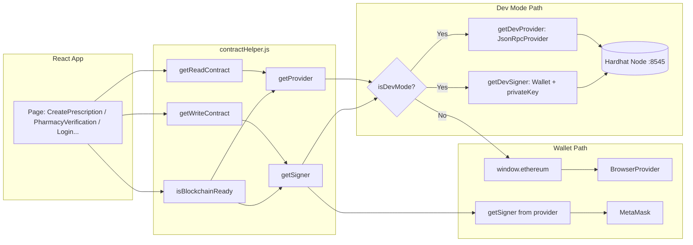
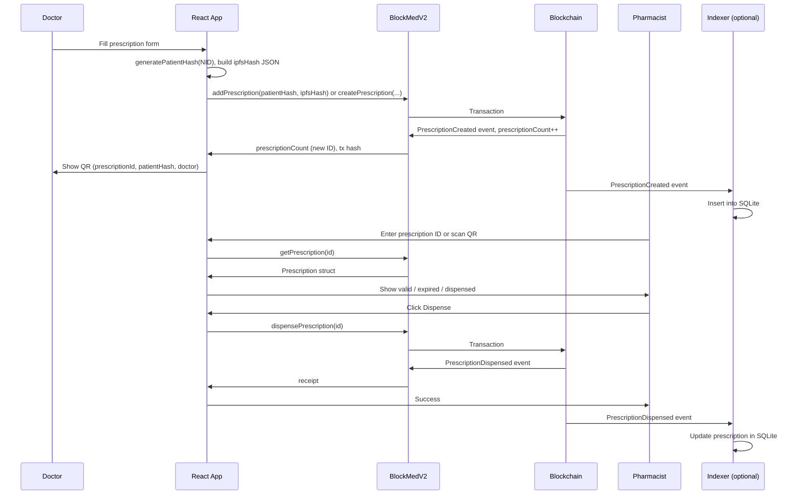

# How Blockchain Works in BlockMed V2

This document explains **every part** of how the blockchain is used in this project: the smart contract, connection layer, frontend usage, indexer, deployment, and data flow. Nothing is omitted.

---

## 1. Overview

BlockMed V2 is a **blockchain-based prescription verification and anti-fake medicine tracking** system. All critical data (users, prescriptions, medicine batches) is stored **on-chain** in a single Solidity contract (`BlockMedV2.sol`). The React frontend reads and writes via **ethers.js** using either:

- **Dev Mode**: Direct connection to a local Hardhat node with pre-funded test accounts (no MetaMask).
- **Wallet Mode**: Browser wallet (e.g. MetaMask) connected to the same network.

An optional **indexer** listens to contract events and stores them in SQLite, exposing an HTTP API for querying prescriptions and batches by doctor/patient.

---

## 2. The Smart Contract (BlockMedV2.sol)

### 2.1 Role-Based Access Control (RBAC)

The contract defines **roles** as an enum:

| Role       | Value | Who can do what |
|-----------|-------|------------------|
| None      | 0     | Not registered |
| Admin     | 1     | Verify users, deactivate users, dispense (like pharmacist) |
| Doctor    | 2     | Create/update/revoke prescriptions |
| Pharmacist| 3     | Dispense prescriptions, dispense from batch, verify batches |
| Manufacturer | 4  | Create medicine batches, recall own batches |
| Patient   | 5     | (No write actions; can view via patient hash) |
| Regulator | 6     | Recall any batch, flag batches |

Each **user** is stored as a struct:

```solidity
struct User {
    address userAddress;
    Role role;
    string name;
    string licenseNumber;   // BMDC for doctors, drug license for pharmacists
    bool isVerified;        // Must be verified by Admin before role actions
    bool isActive;
    uint256 registeredAt;
}
```

- **State**: `mapping(address => User) users` and `address[] userAddresses`.
- **Registration**: Any address can call `registerUser(name, licenseNumber, role)` once (role cannot be None or Admin).
- **Verification**: Only Admin can call `verifyUser(address)`. Doctors and Pharmacists must be verified to create prescriptions or dispense.
- **Deactivation**: Admin can call `deactivateUser(address)` to set `isActive = false`.

---

### 2.2 Prescription Structures and State

**Prescription** (on-chain):

```solidity
struct Prescription {
    uint256 id;
    string patientHash;      // Hash of patient ID (e.g. NID) – no raw PII on-chain
    string ipfsHash;         // In this app: JSON string of prescription details (or future IPFS CID)
    address doctor;
    uint256 createdAt;
    uint256 expiresAt;
    bool isDispensed;
    address dispensedBy;
    uint256 dispensedAt;
    uint256 version;
    bool isActive;
    string digitalSignature; // Optional (V2 createPrescription)
}
```

**Version history** (for updates):

```solidity
struct PrescriptionVersion {
    uint256 prescriptionId;
    uint256 version;
    string ipfsHash;
    uint256 createdAt;
    string reason;
}
```

**State variables**:

- `prescriptionCount` – total number of prescriptions (IDs are 1..prescriptionCount).
- `mapping(uint256 => Prescription) prescriptions` – prescription by ID.
- `mapping(uint256 => PrescriptionVersion[]) prescriptionVersions` – version history per prescription.
- `mapping(string => uint256[]) patientPrescriptions` – patientHash → list of prescription IDs.
- `mapping(address => uint256[]) doctorPrescriptions` – doctor address → list of prescription IDs.

**Key functions**:

| Function | Who | Effect |
|----------|-----|--------|
| `createPrescription(patientHash, ipfsHash, validityDays, digitalSignature)` | Verified Doctor | Creates new prescription, pushes to patientPrescriptions and doctorPrescriptions, appends to prescriptionVersions. |
| `addPrescription(patientHash, ipfsHash)` | Anyone (legacy) | Auto-registers caller as Doctor (verified) and creates prescription with 30-day validity. Used by the app for simplicity. |
| `updatePrescription(id, newIpfsHash, reason)` | Prescribing Doctor | Increments version, updates ipfsHash, appends PrescriptionVersion. |
| `dispensePrescription(id)` | Verified Pharmacist or Admin | Sets isDispensed, dispensedBy, dispensedAt; increments totalDispensations. |
| `revokePrescription(id, reason)` | Prescribing Doctor or Admin | Sets isActive = false. |
| `getPrescription(id)` | Anyone | Returns Prescription struct. |
| `getPrescriptionsByPatient(patientHash)` | Anyone | Returns array of prescription IDs. |
| `getPrescriptionsByDoctor(doctor)` | Anyone | Returns array of prescription IDs. |
| `getPrescriptionVersions(id)` | Anyone | Returns version history. |
| `isPrescriptionValid(id)` | Anyone | Returns (bool, status string): exists, active, not dispensed, not expired. |

**Events**: `PrescriptionCreated`, `PrescriptionUpdated`, `PrescriptionDispensed`, `PrescriptionRevoked` (indexed by id, doctor/pharmacist, timestamps).

---

### 2.3 Medicine Batch Structures and State

**MedicineBatch** (on-chain):

```solidity
struct MedicineBatch {
    uint256 id;
    string batchNumber;
    string medicineName;
    string genericName;
    address manufacturer;
    uint256 manufacturedAt;
    uint256 expiresAt;
    string origin;
    string ipfsHash;         // Detailed batch info
    bool isRecalled;
    string recallReason;
    bool isFlagged;
    string flagReason;
    uint256 createdAt;
    uint256 totalUnits;      // Total units when created (0 = no quantity tracking)
    uint256 dispensedUnits;  // Units sold – used to detect counterfeit (sold > total)
}
```

**State**:

- `batchCount`, `mapping(uint256 => MedicineBatch) medicineBatches`
- `mapping(string => uint256) batchNumberToId` – batchNumber → id
- `mapping(address => uint256[]) manufacturerBatches` – manufacturer → batch IDs
- `flaggedBatches[]`, `recalledBatches[]` – lists of IDs

**Key functions**:

| Function | Who | Effect |
|----------|-----|--------|
| `createMedicineBatch(batchNumber, medicineName, genericName, expiresAt, origin, ipfsHash, totalUnits)` | Verified Manufacturer | Creates batch, sets batchNumberToId, pushes to manufacturerBatches. |
| `dispenseFromBatch(batchId, quantity)` | Pharmacist or Admin | Increases dispensedUnits; reverts if would exceed totalUnits (counterfeit check). |
| `recallBatch(batchId, reason)` | Manufacturer (own), Regulator, or Admin | Sets isRecalled, recallReason; pushes to recalledBatches; emits FakeMedicineAlert. |
| `flagBatch(batchId, reason)` | Any verified user | Sets isFlagged, flagReason; pushes to flaggedBatches; emits FakeMedicineAlert. |
| `getMedicineBatch(id)`, `getBatchByNumber(batchNumber)` | Anyone | Return batch struct. |
| `verifyBatch(batchNumber)` | Anyone | Returns (exists, isRecalled, isFlagged, isExpired, status). |
| `getFlaggedBatches()`, `getRecalledBatches()`, `getBatchesByManufacturer(addr)` | Anyone | Return IDs or list. |

**Events**: `BatchCreated`, `BatchDispensed`, `BatchRecalled`, `BatchFlagged`, `FakeMedicineAlert`.

---

### 2.4 Modifiers and Owner

- **owner**: Set in constructor to `msg.sender`; registered as Admin.
- **Modifiers**: `onlyOwner`, `onlyAdmin`, `onlyDoctor`, `onlyPharmacist`, `onlyPharmacistOrAdmin`, `onlyManufacturer`, `onlyRegulator`, `onlyVerifiedUser` – all enforce role and (where applicable) `isVerified` and `isActive`.

---

## 3. Connection Layer (How the App Talks to the Chain)

### 3.1 Config (`src/utils/config.js`)

- **CONTRACT_ADDRESS**: From `VITE_CONTRACT_ADDRESS` or default (e.g. `0x9fE46736679d2D9a65F0992F2272dE9f3c7fa6e0`). Must match the deployed contract.
- **NETWORKS**: Hardhat (0x7a69 / 31337), Ganache (0x539), Polygon Mumbai (0x13881), Sepolia (0xaa36a7) – chainId, RPC, name, symbol.
- **ROLES**: Numeric role IDs matching the contract enum (0–6).

### 3.2 Dev Mode (`src/utils/devMode.js`)

- **Purpose**: Use the app without MetaMask by connecting directly to `http://127.0.0.1:8545` (Hardhat node).
- **DEV_ACCOUNTS**: Six deterministic Hardhat accounts (address + privateKey) with fixed roles (Admin, Doctor, Pharmacist, Manufacturer, Patient, Regulator).
- **State**: `devModeEnabled`, `currentDevAccount`, `devProvider`, `devSigner`. Persisted in `localStorage` (`blockmed-dev-mode`, `blockmed-dev-account`).
- **enableDevMode(accountIndex)**: Checks Hardhat is reachable, creates `JsonRpcProvider` and `Wallet(signer)` for the chosen account, saves to localStorage.
- **getDevProvider() / getDevSigner()**: Return provider/signer for read/write when Dev Mode is on.
- **testHardhatConnection()**: Sends `eth_blockNumber` to localhost:8545 to see if the node is running.

### 3.3 Contract Helper (`src/utils/contractHelper.js`)

Single place for all contract access:

- **getProvider()**: If Dev Mode → `getDevProvider()` (Hardhat). Else if `window.ethereum` → `ethers.BrowserProvider(window.ethereum)`. Else fallback JsonRpcProvider(localhost:8545).
- **getSigner()**: If Dev Mode → `getDevSigner()`. Else wallet signer from `getProvider().getSigner()`. Throws if no signer (e.g. wallet not connected).
- **getReadContract()**: `new ethers.Contract(CONTRACT_ADDRESS, contractABI, provider)` – no signer, for view/pure calls.
- **getWriteContract()**: Same contract but with **signer** – for sending transactions.
- **getCurrentAccount()**: Dev Mode → dev account address; else `eth_accounts` / `eth_requestAccounts` (never calls wallet when Dev Mode is on).
- **isBlockchainReady()**: Ensures (1) Dev Mode has Hardhat or wallet exists, (2) account exists, (3) contract code at CONTRACT_ADDRESS is non-empty. Returns `{ ready, account }` or `{ ready: false, error }`.
- **executeContract(methodName, args, { isWrite, value })**: Generic caller; for writes waits for `tx.wait()`. Uses **getWriteContract** for writes and **getReadContract** for reads.
- **getFriendlyErrorMessage(error)**: Maps revert/network errors to user-facing messages (e.g. “Only verified pharmacist…”, “Contract not deployed”, “Wallet not connected”).

So: **every read goes through getReadContract() (provider only); every write goes through getWriteContract() (signer).** Dev Mode vs Wallet is decided inside getProvider/getSigner.

### 3.4 Provider Utilities (`src/utils/provider.js`)

- Caching and in-flight coalescing for `getBlockNumber()`, `getCode()`, `getBalance()`.
- `testRpcConnection()` for Hardhat.
- `resetProvider()` clears `window.__sharedBrowserProvider` and caches (e.g. after logout or network switch).

### 3.5 useBlockchain Hook (`src/hooks/useBlockchain.js`)

- Calls `isBlockchainReady()` on mount and exposes `refresh`.
- Exposes: `connected`, `account`, `chainId`, `networkName`, `isDevMode`, `contractAddress`, `error`, `loading`, `getReadContract`, `getWriteContract`, `getBalance`.
- Used by pages that need to show connection status or get contract instances.

---

## 4. Frontend Usage (Where Blockchain Is Used)

### 4.1 Login and User Identity (`LoginPage.jsx`)

1. **Init**: If Dev Mode was saved and Hardhat is running, re-enable Dev Mode and set account. Else if not logged out, `eth_accounts` to see if wallet is already connected.
2. **Connect**: User either enables Dev Mode (pick account) or connects wallet. Then `handleAccountConnected(account)`.
3. **User from chain**: `getReadContract().getUser(account)` → if role !== 0, set user (address, role, name, licenseNumber, isVerified, isActive, registeredAt) in store; else show registration form.
4. **Register**: `getWriteContract().registerUser(name, licenseNumber, role)` (sends tx). Optionally admin then calls `verifyUser(account)` (from User Management or Settings or CLI script).

So: **identity and roles live on-chain**; the app only caches them in the store after reading from the contract.

### 4.2 Create Prescription (`CreatePrescription.jsx`)

1. User fills patient info, symptoms, diagnosis, medicines, etc. **Patient hash** is computed in the frontend: `generatePatientHash(patient)` (e.g. SHA256 of NID or name|DOB|timestamp) – see `src/utils/helpers.js`. No raw NID is sent on-chain.
2. **IPFS hash field**: In this app the “ipfsHash” is a **JSON string** of the full prescription payload (patient, symptoms, diagnosis, medicines, tests, advice, followUp, validityDays). (Real IPFS CID can be used later.)
3. If **blockchain not ready**: prescription is stored only in local demo store and a demo ID is shown; user can “Save to blockchain later” when Dev Mode or wallet is available.
4. If **blockchain ready**: `getWriteContract().addPrescription(patientHash, ipfsHash)` (legacy function that auto-registers as doctor and creates prescription with 30 days validity). After `tx.wait()`, `prescriptionCount()` gives the new ID. UI shows prescription ID, tx hash, block number, and QR code (prescriptionId, patientHash, doctor).

So: **on-chain state** is updated by `addPrescription` (or in a stricter flow by `createPrescription` with validity and signature). Data is **persisted only on the chain**; see BLOCKCHAIN_DATA_PERSISTENCE.md.

### 4.3 Pharmacy Verification and Dispense (`PharmacyVerification.jsx`)

1. **Prescription tab**: User enters prescription ID (or scans QR). `getReadContract().getPrescription(id)` loads the prescription. Optionally `getPrescriptionsByPatient(patientHash)` to load patient history (all IDs for that hash), then each `getPrescription(id)` for details.
2. **Dispense**: If not demo, `getWriteContract().dispensePrescription(prescription.id)` → tx.wait() → UI refreshes prescription (now isDispensed, dispensedBy, dispensedAt).
3. **Batch tab**: User enters batch number. `getReadContract().verifyBatch(batchNumber)` returns (exists, isRecalled, isFlagged, isExpired, status). Batch details via `getBatchByNumber(batchNumber)` or `getMedicineBatch(id)`. Pharmacist can call `dispenseFromBatch(batchId, quantity)` from the same page (write).
4. **Demo mode**: When blockchain is not ready, prescriptions/batches can come from local demo data and “dispense” is simulated in the store only.

So: **all verification and dispense state** is read from and written to the contract.

### 4.4 Other Pages

- **Dashboard**: Uses `getPrescriptionsByDoctor(account)` (or indexer/demo) to list prescriptions for the logged-in doctor.
- **Patient History / Patient Portal**: Use **patientHash** (e.g. from NID) → `getPrescriptionsByPatient(patientHash)` then fetch each prescription.
- **Activity Log**: Can show on-chain events (prescription created/dispensed, batch created/recalled/flagged).
- **User Management (Admin)**: `getAllUsers()` (contract), `verifyUser(address)`, `deactivateUser(address)` via write contract.
- **Settings**: Admin can call `verifyUser(account)` for current user.
- **Batch Management**: Create batch (manufacturer) → `createMedicineBatch(...)`; list batches by manufacturer or global; recall/flag via contract.

All of these use **contractHelper** (getReadContract / getWriteContract) and optionally **blockchainData.js** (e.g. `getAllPrescriptionIds`, `fetchPrescriptionById`, `fetchAllPrescriptions`).

---

## 5. Blockchain Data Helper (`src/utils/blockchainData.js`)

- **getAllPrescriptionIds()**: Reads `prescriptionCount()`, returns `[1, 2, ..., count]`.
- **fetchPrescriptionById(id)**: `getPrescription(id)` then normalize to a simple object (id, patientHash, ipfsHash, doctor, createdAt, expiresAt, isDispensed, dispensedBy, dispensedAt, version, isActive).
- **fetchPrescriptionsByIds(ids, limit)**: Fetches each by ID, returns array of normalized prescriptions.
- **fetchAllPrescriptions(limit)**: getAllPrescriptionIds() then fetchPrescriptionsByIds – used for admin/audit “list all”. All data is **read from the blockchain**; nothing is stored only in the app.

---

## 6. Indexer (Optional Off-Chain Mirror)

**Script**: `scripts/indexer/index.js`.

- **Purpose**: Listen to BlockMedV2 events and mirror them into **SQLite** (`scripts/indexer/data/blockmed.db`) so prescriptions/batches can be queried via HTTP without hitting the chain every time.
- **Config**: `RPC_URL` (default localhost:8545), `CONTRACT_ADDRESS`, `INDEXER_PORT` (default 3002), `INDEXER_DB` (path to SQLite).
- **Events indexed**: PrescriptionCreated, PrescriptionUpdated, PrescriptionDispensed, BatchCreated, BatchRecalled, BatchFlagged.
- **Logic**: On start, **backfill** from `lastBlock` (stored in `indexer_state` table) to current block by polling `provider.getLogs()` in chunks (e.g. 2000 blocks), parse logs with ethers Interface, update SQLite (insert/update prescriptions and batches). Then **live**: `contract.on(eventName, ...)` and on each event call the same index logic. So the DB is always a mirror of events.
- **HTTP API** (Express):
  - `GET /api/health` – ok, lastBlock, contract.
  - `GET /api/prescriptions?doctor=0x...&patientHash=...&limit=100` – list from DB.
  - `GET /api/prescriptions/:id` – one prescription by ID.
  - `GET /api/batches?limit=100` – list batches.
- **Usage**: `CONTRACT_ADDRESS=0x... RPC_URL=http://127.0.0.1:8545 node scripts/indexer/index.js`. Frontend can optionally use this API for listing (e.g. by doctor) instead of calling the contract for every ID.

---

## 7. Deployment and Scripts

### 7.1 Deploy

- **check-and-deploy.cjs**: Run with `npx hardhat run scripts/check-and-deploy.cjs --network localhost`. Reads CONTRACT_ADDRESS from `src/utils/config.js`. If no code at that address (or FORCE_DEPLOY=1), deploys BlockMedV2, then **updates config** and writes `.env.local` with `VITE_CONTRACT_ADDRESS=<new address>`. So after deploy, the app uses the new contract.
- **deploy.js / deploy.cjs**: Standard Hardhat deploy; contract is deployed on the selected network (e.g. localhost). Owner becomes Admin automatically in constructor.

### 7.2 Verify User (CLI)

- **verify-user.cjs**: `USER_ADDRESS=0x... npx hardhat run scripts/verify-user.cjs --network localhost`. Uses first Hardhat account as admin and calls `contract.verifyUser(userAddress)`. Used when testing without using the UI.

### 7.3 Fund Wallet / Test Scripts

- **fund-wallet.cjs**: Fund an address on local network.
- **test-local.cjs**, **test-prescription.mjs**, **test-all-features.mjs**: Test contract methods (register, verify, create prescription, dispense, batches, etc.) against local Hardhat.

---

## 8. End-to-End Data Flow (Summary)

1. **Network**: App connects to a chain (Hardhat local / Ganache / Polygon Mumbai / Sepolia) via Dev Mode (direct RPC) or Wallet (MetaMask).
2. **Contract**: One BlockMedV2 contract at `CONTRACT_ADDRESS` holds all users, prescriptions, and batches.
3. **Login**: Wallet/Dev account → `getUser(account)` → role and verification from chain → store in Zustand. Register with `registerUser`; Admin verifies with `verifyUser`.
4. **Create prescription**: Frontend computes patientHash (no PII), builds JSON for “ipfsHash” → `addPrescription(patientHash, ipfsHash)` (or `createPrescription` with validity) → new ID from `prescriptionCount()` → QR and tx hash shown.
5. **Pharmacy**: Look up by prescription ID or patient hash → `getPrescription` / `getPrescriptionsByPatient` → dispense with `dispensePrescription(id)`. Batch: `verifyBatch(batchNumber)`, `dispenseFromBatch(batchId, quantity)`.
6. **Persistence**: Data lives only on-chain (and optionally in indexer DB). Restarting the app or closing the project does not delete data; restarting the Hardhat node (in-memory) resets the local chain; changing contract address shows a different “world” of data.

---

## 9. Diagrams

### 9.1 Full System Architecture (Blockchain + App + Indexer)

```mermaid
flowchart TB
    subgraph Users["👥 Users"]
        Doctor[Doctor]
        Pharmacist[Pharmacist]
        Admin[Admin]
        Manufacturer[Manufacturer]
        Patient[Patient]
    end

    subgraph Browser["🌐 Browser (React App)"]
        LoginPage[LoginPage]
        CreatePrescription[CreatePrescription]
        PharmacyVerification[PharmacyVerification]
        UserManagement[UserManagement]
        Dashboard[Dashboard]
        BatchManagement[BatchManagement]
    end

    subgraph Connection["🔌 Connection Layer"]
        useBlockchain[useBlockchain hook]
        contractHelper[contractHelper.js]
        devMode[devMode.js]
        config[config.js]
    end

    subgraph ProviderChoice["Provider / Signer"]
        DevMode[Dev Mode: JsonRpcProvider + Wallet<br/>localhost:8545]
        WalletMode[Wallet: BrowserProvider + getSigner<br/>MetaMask]
    end

    subgraph Contract["📄 BlockMedV2.sol (On-Chain)"]
        UsersMapping[users[address]]
        PrescriptionsMapping[prescriptions[id]]
        PatientPrescriptions[patientPrescriptions[patientHash]]
        DoctorPrescriptions[doctorPrescriptions[doctor]]
        BatchesMapping[medicineBatches[id]]
        BatchNumberToId[batchNumberToId[number]]
    end

    subgraph Blockchain["🔗 Blockchain (EVM)"]
        Hardhat[Hardhat Local / Ganache]
        Testnet[Polygon Mumbai / Sepolia]
    end

    subgraph Indexer["📊 Indexer (Optional)"]
        EventListener[Event Listener<br/>PrescriptionCreated, Dispensed, BatchCreated...]
        SQLite[(SQLite DB)]
        HTTPAPI[HTTP API :3002<br/>/api/prescriptions, /api/batches]
    end

    Doctor --> LoginPage
    Pharmacist --> LoginPage
    Admin --> LoginPage
    Doctor --> CreatePrescription
    Pharmacist --> PharmacyVerification
    Admin --> UserManagement
    Manufacturer --> BatchManagement

    LoginPage --> useBlockchain
    CreatePrescription --> contractHelper
    PharmacyVerification --> contractHelper
    UserManagement --> contractHelper
    Dashboard --> useBlockchain
    BatchManagement --> contractHelper

    useBlockchain --> contractHelper
    contractHelper --> devMode
    contractHelper --> config
    contractHelper --> ProviderChoice

    ProviderChoice --> Contract
    Contract --> Blockchain
    Hardhat --> Blockchain
    Testnet --> Blockchain

    Blockchain --> EventListener
    EventListener --> SQLite
    SQLite --> HTTPAPI
    Dashboard -.->|optional| HTTPAPI
```

### 9.2 Connection Flow (Dev Mode vs Wallet)



### 9.3 On-Chain Data Structures and Mappings

```mermaid
flowchart TB
    subgraph BlockMedV2["BlockMedV2 Contract State"]
        subgraph Users["User Management"]
            usersMapping["users[address] → User struct"]
            userAddresses["userAddresses[]"]
        end

        subgraph Prescriptions["Prescription Management"]
            prescriptionCount["prescriptionCount"]
            prescriptionsMapping["prescriptions[id] → Prescription"]
            prescriptionVersions["prescriptionVersions[id] → PrescriptionVersion[]"]
            patientPrescriptions["patientPrescriptions[patientHash] → id[]"]
            doctorPrescriptions["doctorPrescriptions[doctor] → id[]"]
        end

        subgraph Batches["Medicine Batch Management"]
            batchCount["batchCount"]
            medicineBatches["medicineBatches[id] → MedicineBatch"]
            batchNumberToId["batchNumberToId[batchNumber] → id"]
            manufacturerBatches["manufacturerBatches[manufacturer] → id[]"]
            flaggedBatches["flaggedBatches[]"]
            recalledBatches["recalledBatches[]"]
        end

        subgraph Counters["Counters"]
            totalVerifications["totalVerifications"]
            totalDispensations["totalDispensations"]
        end
    end

    usersMapping --> UserStruct["User: address, role, name, licenseNumber, isVerified, isActive, registeredAt"]
    prescriptionsMapping --> PrescriptionStruct["Prescription: id, patientHash, ipfsHash, doctor, createdAt, expiresAt, isDispensed, dispensedBy, dispensedAt, version, isActive, digitalSignature"]
    medicineBatches --> BatchStruct["MedicineBatch: id, batchNumber, medicineName, genericName, manufacturer, manufacturedAt, expiresAt, origin, ipfsHash, isRecalled, isFlagged, totalUnits, dispensedUnits"]
```



### 9.4 Prescription Lifecycle (On-Chain)



### 9.5 User Registration and Verification Flow

```mermaid
sequenceDiagram
    participant User
    participant App as React App
    participant Contract as BlockMedV2
    participant Chain as Blockchain
    participant Admin

    User->>App: Connect wallet / Enable Dev Mode
    App->>Contract: getUser(account)
    Contract->>App: User struct (role=0 if not registered)

    alt Not registered
        App->>User: Show registration form
        User->>App: name, licenseNumber, role
        App->>Contract: registerUser(name, licenseNumber, role)
        Contract->>Chain: Transaction, UserRegistered event
        App->>User: Registered (isVerified = false)
    end

    Admin->>App: User Management or Settings or CLI
    App->>Contract: verifyUser(userAddress)
    Contract->>Chain: Transaction, UserVerified event
    App->>Admin: User verified

    Note over User,Admin: Only verified Doctor can createPrescription; only verified Pharmacist can dispensePrescription
```

### 9.6 Batch Verification and Anti-Counterfeit Flow

```mermaid
flowchart LR
    subgraph Manufacturer["Manufacturer"]
        M1[createMedicineBatch<br/>batchNumber, medicineName, totalUnits...]
    end

    subgraph Chain["BlockMedV2"]
        BatchCreated[BatchCreated event]
        BatchStore[medicineBatches[id]<br/>batchNumberToId[number]]
    end

    subgraph Pharmacist["Pharmacist"]
        P1[verifyBatch(batchNumber)]
        P2[dispenseFromBatch(batchId, quantity)]
    end

    subgraph ContractLogic["Contract Checks"]
        Exists{Batch exists?}
        Recalled{isRecalled?}
        Expired{expired?}
        Units{dispensedUnits + qty ≤ totalUnits?}
        Status[Return status: VERIFIED / RECALLED / FLAGGED / EXPIRED / UNKNOWN]
    end

    subgraph Regulator["Regulator / Manufacturer"]
        R1[recallBatch(id, reason)]
        R2[flagBatch(id, reason)]
    end

    M1 --> BatchCreated
    BatchCreated --> BatchStore
    P1 --> Exists
    Exists --> Recalled
    Recalled --> Expired
    Expired --> Status
    P2 --> Units
    Units -->|OK| BatchStore
    R1 --> BatchStore
    R2 --> BatchStore
```

---

This is the complete picture of how blockchain works in BlockMed V2: no part of the chain interaction is omitted from this document.
